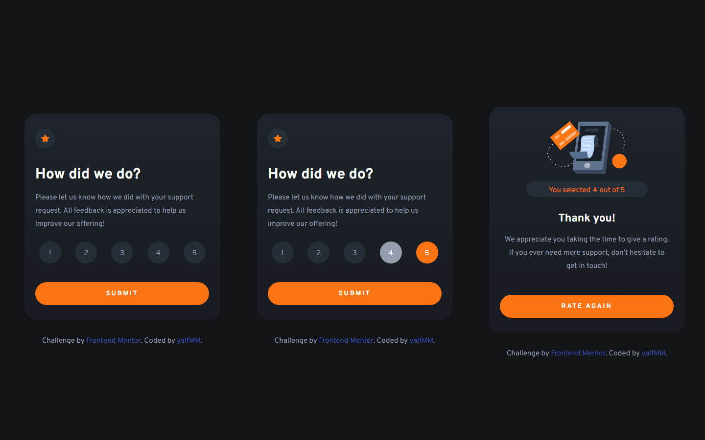

# Frontend Mentor - Interactive rating component

## Hello! 👋

Here is a solution to [Interactive rating component](https://www.frontendmentor.io/challenges/interactive-rating-component-koxpeBUmI). Frontend Mentor challenges help you improve your coding skills by building realistic projects. 

### Screenshot

## Process

### What I learned

- Basic positioning in HTML, CSS and JS

### Built with

- Semantic HTML5 markup
- CSS custom properties
- JS functions
- Responsive Design

## Aditional

- I added button in card rating score for return to rate score select card

## Author

- Website - [github/yalfmm](https://github.com/yalfmm)
- Frontend Mentor - [@yalfmm](https://www.frontendmentor.io/profile/yalfmm)